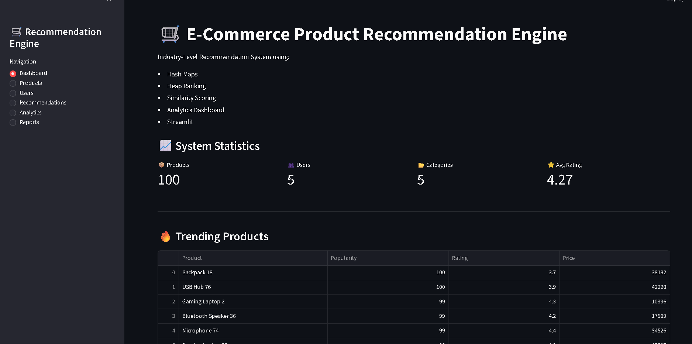
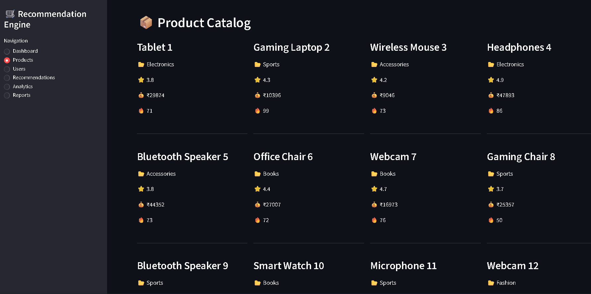
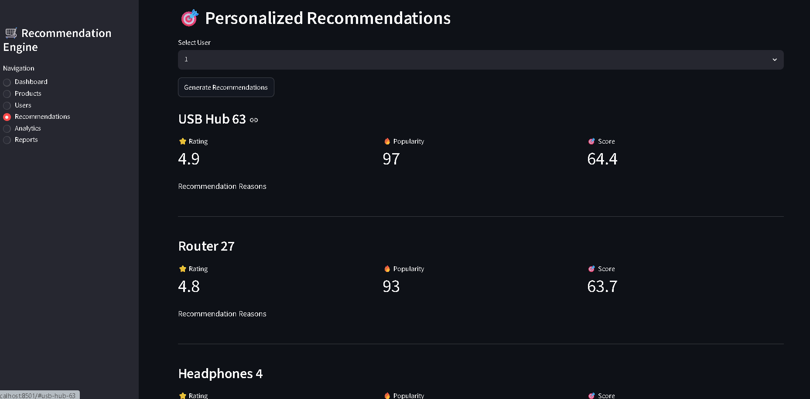
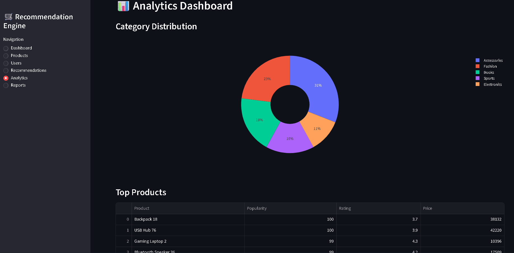
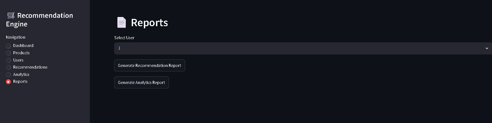

# 🛒 E-Commerce Product Recommendation Engine

An industry-level E-Commerce Product Recommendation System built using Python, Data Structures & Algorithms (DSA), Object-Oriented Programming (OOP), and Streamlit.

The system provides personalized product recommendations based on user behavior, similarity scoring, popularity ranking, and analytics visualization.

---

## 🚀 Live Demo

🌐 Streamlit Application

https://e-commerce-appuct-recommendation-engine-2ayye589zsplbgasocbxcg.streamlit.app/

📂 GitHub Repository

https://github.com/Vayu-143/E-Commerce-Product-Recommendation-Engine

---

## 📌 Project Overview

This project simulates a real-world recommendation engine used in modern e-commerce platforms such as Amazon, Flipkart, and Myntra.

The recommendation engine analyzes:

- Purchase History
- Search History
- Cart Items
- Product Ratings
- Product Popularity
- Category Similarity

and generates personalized recommendations for users.

---

## ✨ Features

### 🎯 Personalized Recommendations

Generates product recommendations based on:

- User purchase history
- User search history
- User cart items
- Product popularity
- Product ratings

---

### 📦 Product Management

- 100+ Products Dataset
- Multiple Categories
- Product Ratings
- Product Pricing
- Product Popularity Scores

---

### 👥 User Management

- Multiple User Profiles
- Purchase Tracking
- Search Tracking
- Cart Tracking

---

### 📊 Analytics Dashboard

Interactive analytics including:

- Category Distribution
- Average Rating by Category
- Product Statistics
- User Statistics
- Trending Products
- Top Rated Products

---

### 📄 Report Generation

Generate:

- Recommendation Reports
- Analytics Reports

and download them directly from the Streamlit application.

---

## 🏗️ System Architecture

```text
User
 │
 ▼
Recommendation Service
 │
 ├── Similarity Service
 ├── Popularity Ranking
 ├── Rating Analysis
 │
 ▼
Recommendation Engine
 │
 ▼
Analytics Service
 │
 ▼
Report Service
 │
 ▼
Streamlit Dashboard
```

---

## 🧠 DSA Concepts Used

This project demonstrates multiple Data Structures and Algorithms concepts:

### Hash Maps

Used for:

- Product Storage
- User Storage
- Fast Lookup Operations

Complexity:

```text
O(1)
```

---

### Heap Priority Queue

Used for:

- Top Product Ranking
- Recommendation Sorting

Complexity:

```text
O(log n)
```

---

### Similarity Scoring

Used to determine:

- Related Products
- Category Matching
- Personalized Ranking

---

### Sorting Algorithms

Used for:

- Top Rated Products
- Trending Products
- Analytics Rankings

Complexity:

```text
O(n log n)
```

---

## 📂 Project Structure

```text
E-Commerce-Product-Recommendation-Engine
│
├── data
│   ├── products.json
│   ├── users.json
│
├── docs
│   ├── architecture.md
│   ├── project_report.md
│
├── images
│
├── outputs
│
├── src
│   ├── models
│   ├── services
│   ├── storage
│   └── utils
│
├── tests
│
├── app.py
├── main.py
├── requirements.txt
├── README.md
└── .gitignore
```

---

## ⚙️ Technologies Used

### Backend

- Python 3
- OOP
- JSON Storage

### Data Structures

- Hash Maps
- Heap Queue
- Lists
- Dictionaries

### Analytics

- Pandas
- Plotly

### Frontend

- Streamlit

### Testing

- Python Unit Testing

---

## 📈 Dashboard Modules

### Dashboard

Displays:

- Total Products
- Total Users
- Categories
- Average Ratings
- Trending Products
- Top Rated Products

---

### Products

Displays:

- Product Catalog
- Ratings
- Pricing
- Popularity Metrics

---

### Users

Displays:

- User Information
- Purchase Statistics
- Search Statistics
- Cart Statistics

---

### Recommendations

Generates:

- Personalized Product Suggestions
- Recommendation Scores
- Recommendation Reasons

---

### Analytics

Displays:

- Pie Charts
- Product Distribution
- Average Ratings
- Top Popular Products

---

### Reports

Download:

- Recommendation Report
- Analytics Report

---
## 📸 Application Screenshots

### 🏠 Dashboard

Shows system statistics, trending products, and top-rated products.



---

### 📦 Products Page

Displays all products with category, rating, price, and popularity metrics.



---

### 🎯 Recommendations Page

Generates personalized product recommendations using similarity scoring and ranking algorithms.



---

### 📊 Analytics Dashboard

Provides category distribution, ratings analysis, and product insights through interactive charts.



---

### 📄 Reports Module

Generate and download recommendation and analytics reports directly from the application.



## ▶️ Installation

Clone the repository:

```bash
git clone https://github.com/Vayu-143/E-Commerce-Product-Recommendation-Engine.git
```

Move into project directory:

```bash
cd E-Commerce-Product-Recommendation-Engine
```

Install dependencies:

```bash
pip install -r requirements.txt
```

Run Streamlit:

```bash
streamlit run app.py
```

---

## 📊 Sample Recommendation Output

```text
Gaming Laptop
Score: 95.8

Reasons:
✓ Same Category Purchase
✓ High Rating
✓ Popular Product
```

---

## 🎓 Learning Outcomes

Through this project I practiced:

- Object-Oriented Programming
- Data Structures & Algorithms
- Recommendation Systems
- Data Analytics
- Streamlit Development
- Software Architecture
- Report Generation
- Git & GitHub

---

## 📚 Future Improvements

- Machine Learning Recommendation Engine
- Collaborative Filtering
- Content-Based Filtering
- User Authentication
- Database Integration (MySQL/PostgreSQL)
- Cloud Deployment
- Product Image Management
- Admin Dashboard

---

## 👨‍💻 Author

### Vayunandan Mishra

Electronis and communication Engineering Student

GitHub:
https://github.com/Vayu-143

LinkedIn:
(Add your LinkedIn URL here)

---

## ⭐ Project Highlights

✔ Industry-Level Project Structure

✔ Streamlit Interactive Dashboard

✔ 100+ Products Dataset

✔ Personalized Recommendation Engine

✔ DSA-Based Ranking System

✔ Analytics Dashboard

✔ Downloadable Reports

✔ GitHub + Streamlit Deployment

---

If you found this project useful, please consider giving it a ⭐ on GitHub.